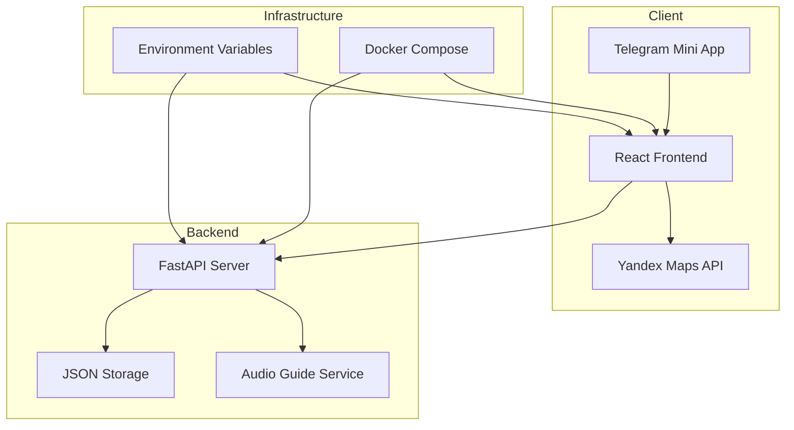

# Telegram Mini App for Audio Guides - Architecture Plan

## Project Overview
A full-stack Telegram Mini App for audio guides in Nizhny Novgorod, featuring an interactive map with route visualization, attraction details, and audio playback functionality.

## Tech Stack

### Backend
- **Language**: Python 3.11+
- **Framework**: FastAPI
- **Package Manager**: uv
- **Data Storage**: JSON files (no database)
- **Code Quality**: ruff, mypy, pylint

### Frontend
- **Language**: TypeScript
- **Framework**: React 18+
- **Build Tool**: Vite
- **Maps**: Yandex Maps API
- **UI Library**: Tailwind CSS (optional, for styling)

### Infrastructure
- **Containerization**: Docker (multi-stage build)
- **Orchestration**: docker-compose
- **Environment**: .env files for secrets

## Project Structure

```
merchant/
├── backend/
│   ├── app/
│   │   ├── __init__.py
│   │   ├── main.py                 # FastAPI application entry point
│   │   ├── api/
│   │   │   ├── __init__.py
│   │   │   ├── routes.py           # API route definitions
│   │   │   └── models.py           # Pydantic models
│   │   ├── core/
│   │   │   ├── __init__.py
│   │   │   ├── config.py           # Configuration management
│   │   │   └── security.py         # Security utilities (JWT, etc.)
│   │   └── services/
│   │       ├── __init__.py
│   │       └── audio_guide_service.py  # Business logic
│   ├── data/
│   │   ├── attractions.json        # Attraction data
│   │   └── routes.json             # Route data
│   ├── tests/
│   │   ├── __init__.py
│   │   └── test_api.py
│   ├── pyproject.toml              # uv package configuration
│   ├── ruff.toml                   # Ruff configuration
│   ├── .mypy.ini                   # MyPy configuration
│   ├── .pylintrc                   # Pylint configuration
│   └── Dockerfile                  # Backend Dockerfile
│
├── frontend/
│   ├── public/
│   │   └── index.html
│   ├── src/
│   │   ├── main.tsx                # React entry point
│   │   ├── App.tsx                 # Main App component
│   │   ├── index.css               # Global styles
│   │   ├── components/
│   │   │   ├── Map.tsx             # Yandex Maps integration
│   │   │   ├── AttractionCard.tsx  # Attraction detail card
│   │   │   └── AudioPlayer.tsx     # Audio player component
│   │   ├── services/
│   │   │   └── api.ts              # API client
│   │   ├── types/
│   │   │   └── index.ts           # TypeScript type definitions
│   │   └── utils/
│   │       └── telegram.ts        # Telegram Mini App utilities
│   ├── package.json
│   ├── tsconfig.json
│   ├── vite.config.ts
│   ├── tailwind.config.js         # Optional
│   └── Dockerfile                  # Frontend Dockerfile (multi-stage)
│
├── docker-compose.yml              # Orchestration configuration
├── .env.example                    # Environment variables template
├── .gitignore
└── README.md                       # Setup and deployment instructions
```

## Architecture Diagram



## Data Models

### Attraction Model
```json
{
  "id": "string",
  "name": "string",
  "description": "string",
  "address": "string",
  "coordinates": {
    "lat": "number",
    "lon": "number"
  },
  "image": "string",
  "audio_url": "string",
  "order": "number"
}
```

### Route Model
```json
{
  "id": "string",
  "name": "string",
  "description": "string",
  "attraction_ids": ["string"],
  "polyline": [[number, number]]
}
```

## API Endpoints

### Backend API
- `GET /api/v1/attractions` - List all attractions
- `GET /api/v1/attractions/{id}` - Get attraction details
- `GET /api/v1/routes` - List all routes
- `GET /api/v1/routes/{id}` - Get route details
- `GET /api/v1/routes/{id}/attractions` - Get attractions for a route
- `GET /health` - Health check endpoint

## Nizhny Novgorod Route Data

### Attractions
1. **Nizhny Novgorod State Bank**
   - Address: ul. Bolshaya Pokrovskaya, 26
   - Coordinates: 56.3269, 44.0075
   - Order: 1

2. **Zelensky Descent (Transition Point)**
   - Address: Zelensky descent
   - Coordinates: 56.3280, 44.0085
   - Order: 2

3. **Bugrov's Night Shelter**
   - Address: ul. Rozhdestvenskaya, 2
   - Coordinates: 56.3290, 44.0095
   - Order: 3

## Component Architecture

### Frontend Components

#### Map.tsx
- Renders Yandex Map
- Displays route polyline
- Shows attraction markers
- Handles marker click events

#### AttractionCard.tsx
- Displays attraction details
- Shows attraction image
- Provides audio playback button
- Handles audio player state

#### AudioPlayer.tsx
- Plays audio guides
- Controls: play/pause, progress, volume
- Handles audio loading and errors

### Backend Services

#### AudioGuideService
- Manages attraction data
- Manages route data
- Provides business logic for audio guides
- Handles data validation

## Docker Configuration

### Backend Dockerfile
```dockerfile
FROM python:3.11-slim
WORKDIR /app
COPY pyproject.toml ./
RUN pip install uv && uv sync
COPY . .
CMD ["uvicorn", "app.main:app", "--host", "0.0.0.0", "--port", "8000"]
```

### Frontend Dockerfile (Multi-stage)
```dockerfile
# Build stage
FROM node:18-alpine AS builder
WORKDIR /app
COPY package*.json ./
RUN npm install
COPY . .
RUN npm run build

# Production stage
FROM nginx:alpine
COPY --from=builder /app/dist /usr/share/nginx/html
COPY nginx.conf /etc/nginx/conf.d/default.conf
EXPOSE 80
CMD ["nginx", "-g", "daemon off;"]
```

### Docker Compose
```yaml
version: '3.8'
services:
  backend:
    build: ./backend
    ports:
      - "8000:8000"
    environment:
      - BOT_TOKEN=${BOT_TOKEN}
      - YANDEX_MAPS_API_KEY=${YANDEX_MAPS_API_KEY}
    volumes:
      - ./backend/data:/app/data

  frontend:
    build: ./frontend
    ports:
      - "80:80"
    depends_on:
      - backend
```

## Code Quality Configuration

### ruff.toml
```toml
target-version = "py311"
line-length = 100
select = ["E", "F", "I", "N", "W"]
```

### .mypy.ini
```ini
[mypy]
python_version = 3.11
warn_return_any = True
warn_unused_configs = True
disallow_untyped_defs = True
```

### .pylintrc
```ini
[MASTER]
disable = C0111,C0103

[FORMAT]
max-line-length = 100
```

## Environment Variables

### .env.example
```env
# Telegram Bot Token
BOT_TOKEN=your_bot_token_here

# Yandex Maps API Key
YANDEX_MAPS_API_KEY=your_yandex_maps_api_key_here

# Backend Configuration
BACKEND_HOST=0.0.0.0
BACKEND_PORT=8000

# Frontend Configuration
VITE_API_URL=http://localhost:8000/api/v1
VITE_YANDEX_MAPS_API_KEY=your_yandex_maps_api_key_here
```

## Security Considerations

1. **Environment Variables**: All secrets stored in .env files, never committed to git
2. **CORS**: Configure CORS for frontend-backend communication
3. **Input Validation**: Use Pydantic models for request/response validation
4. **Rate Limiting**: Implement rate limiting for API endpoints
5. **HTTPS**: Use HTTPS in production (via nginx reverse proxy)

## Development Workflow

### Local Development
1. Clone repository
2. Copy `.env.example` to `.env` and fill in values
3. Install backend dependencies: `uv sync`
4. Install frontend dependencies: `npm install`
5. Start backend: `uvicorn app.main:app --reload`
6. Start frontend: `npm run dev`

### Docker Development
1. Copy `.env.example` to `.env` and fill in values
2. Build and run: `docker-compose up --build`
3. Access frontend at: http://localhost
4. Access backend API at: http://localhost:8000

## Testing Strategy

### Backend Tests
- Unit tests for services
- Integration tests for API endpoints
- Test data validation
- Test error handling

### Frontend Tests
- Component tests with React Testing Library
- Integration tests for user flows
- Mock API responses

## Deployment Checklist

- [ ] Configure production environment variables
- [ ] Set up HTTPS/SSL certificates
- [ ] Configure nginx reverse proxy
- [ ] Set up monitoring and logging
- [ ] Configure backup strategy for JSON data
- [ ] Set up CI/CD pipeline
- [ ] Performance testing
- [ ] Security audit

## Future Enhancements

1. **Database Migration**: Move from JSON to PostgreSQL/SQLite
2. **Authentication**: Add user authentication and authorization
3. **Audio Upload**: Allow admin to upload audio guides
4. **Multiple Routes**: Support multiple city routes
5. **User Progress**: Track user's progress through routes
6. **Offline Support**: Cache audio and map data for offline use
7. **Multi-language**: Support multiple languages
8. **Analytics**: Track user engagement and popular attractions
